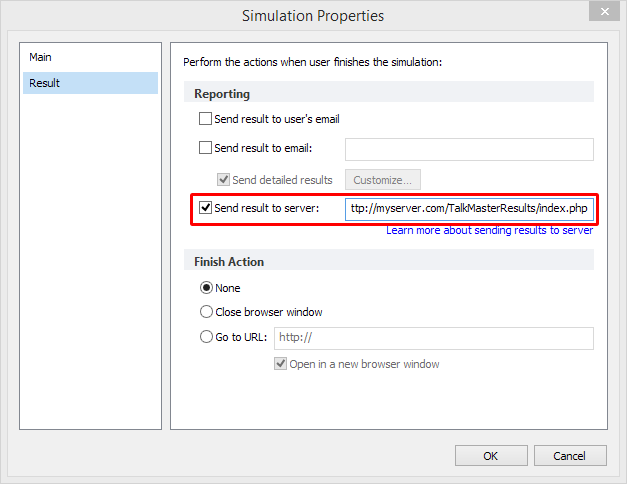
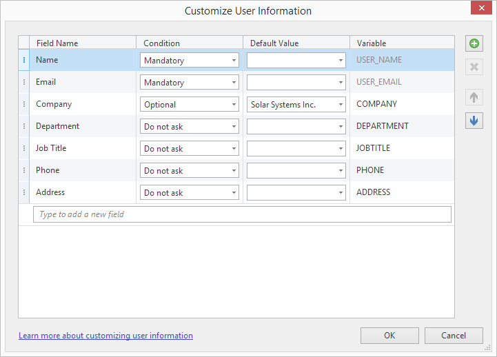

#  How to Send TalkMaster Results to Server

iSpring TalkMaster provides a variety of ways to deliver results for checking learners’ progress. Before you start configuring your server, make sure that these other options are not applicable in your case:

- iSpring [Learning Management System](https://www.ispringsolutions.com/products/ispring-learn). This is the most preferable option, because it tracks detailed dialog simulation progress automatically. The dialog simulation and all statistics are stored in your own iSpring LMS account.
- Any other SCORM-compliant [learning system](https://www.ispringsolutions.com/supported-lms). SCORM is a learning standard which makes tracking learners’ progress easy. You can host one or more LMSs on your own server(s), but generally, hosting is included with the system.
- Email. This is a very easy way to collect results, but less structured. Your content can be hosted anywhere on the web or on local computers with internet access.

Sending results to a server is a less convenient option, but can be used for building your own tracking system. It is mainly used for isolated systems that require the highest level of security with no internet access. You can also host your content anywhere on the web.

With this approach, you may build your own tracking system on your server. This advanced solution **will require additional development and will include extra costs**, depending on the requirements for creating your custom system (from $1k to $10k).

Here you can get a free sample script that will process incoming result data on your server: 
https://github.com/ispringsolutions/ConversationSimulationResults

This script is provided “as is” with text instructions inside and a description in this article. The script provides basic functionality that lets you test out the sending results to server option. It parses the data and appends it to a text file.

No support is provided for modifying it or setting up on your server.

You are welcome to modify this script and set it up on your server, or request expert support for an additional fee.

## PHP sample script
This script is provided “as is” with text instructions inside and a description in this article. The script provides basic functionality that lets you test out the sending results to server option. It parses the data and appends it to a text file.

No support is provided for modifying it or setting up on your server.

You are welcome to modify this script and set it up on your server, or request expert support for an additional fee.
## Prerequisites

- A copy of TalkMaster or iSpring Suite (which includes TalkMaster).

- A server with full access to the file directory and configuration settings.

- Server-side application programming skills (PHP or C#, SQL, XML).

# TalkMaster configuration
Turn on the **Send results to server** option in TalkMaster Properties. In order to do that, follow these steps:

1. Open an existing dialog simulation or create a new one.

2. Select **Properties** on the TalkMaster toolbar.

3. Then select **Result** on the left.

4. Check the **Send result to server** checkbox and enter the web address of the parsing script (GitHub sample) on your server. For example, https://mysеrvеr.com/TalkMasterResults/index.php

5. Click **OK** to save settings.

6. **Publish** your dialog simulation to **Mobile (HTML5)** format so it will work on all devices and from any location (local and http).

Note: Publishing to Desktop (Flash) is [not recommended](https://www.macromedia.com/support/documentation/en/flashplayer/help/settings_manager04.html).

# List of variables sent to server

On each user attempt, the TalkMaster dialog sends user variables and scoring variables that include passing status, completion score, detailed .xml results, etc.

The HTTP POST method is used to send data to the server. Here is the list of variables:

|  Variable | Discription | Comment  |
| ------------ | ------------ | ------------ |
|  v   | TalkMaster version  |   |
|  **dr** | Detailed results in .xml format | optional, when available  |
|  sp | Earned points | optional, when available  |
|  ps | Passing score | optional, when available, depends on the Passing Score option  |
| tp | Gained score | optional, when available |
| sn | Dialog taker's username | optional, when available, deprecated in version 7, use USER_NAME instead  |
| se | Dialog taker's email address | optional, when available, deprecated in version 7, use USER_EMAIL instead  |
| te | Destination email | optional, when available  |
| st | Dialog simulation title |  |
| t | Dialog type |  |
| rt | An .xml dialog simulation report template for generating a message | optional, when available |
| sid | User ID | optional, when available |
| ut | Used time | optional, when available |

|  Variable | Discription | Comment  |
| ------------ | ------------ | ------------ |
| [user variable] | [value of a user variable] | any variable can be added, see the description below |
| USER_NAME | Dialog taker's username | user variable |
| USER_EMAIL | Dialog taker's email address | user variable |
| vt | Array of available user variables | Each array item is an array with two labeled items: id (contains variable id, ex. "COMPANY") and title (contains variable title, ex. "Company") |

## User variables

If you place your dialog on an LMS, user variables are passed to the dialog simulation automatically by means of the LMS.

If you don’t use an LMS, but instead host dialogues on your website, users must enter their details before starting the dialogue. (This also applies to quizzes.)

Turn on the option that will show the dialog login screen (**Properties > Main > Ask for user information**). When users opens the dialog, they will be prompted to enter a name and email.

Also, you can configure the login screen and include extra fields. They can be optional or mandatory. To configure the login screen, click Customize (**Properties > Main > Ask for user information > Customize**).

According to the settings above, when a dialog simulation is published and launched, users will see a form with three fields and a default value that can be changed.

A variable can be *Optional* or *Mandatory*. Choose *Do not ask* to deactivate.

Examples of **user variables**:

    USER_NAME = ”John”

    USER_EMAIL = ”John@gmail.com”

    COMPANY = ”Solar Systems, Inc.”

Example of a **vt** array:

    vt = [{id:USER_NAME, title:"Name"}, {id:USER_EMAIL, title:"Email"}, {id:COMPANY, title:"Company"}]

# Detailed results

TalkMaster captures every step of a user’s progress and can provide a very precise description of the entire attempt. Detailed results include the text of every question, settings, a list of pre-set answers, and the user’s choice or answer text. This adds up to a lot of data; therefore, it has to be well-structured.

Detailed results are sent in .xml format within the **dr** variable.

Here is an **XML schema** that describes the structure of the detailed results .xml:
https://github.com/ispringsolutions/TalkMasterResults/blob/master/TalkMasterReport.xsd

Use your browser’s Developer Tools (F12) to see the contents of a POST request, including this XML file. For a free third-party solution that’s popular among experts, try [Fiddler](https://www.telerik.com/fiddler) by Telerik.

# Support Note

We at iSpring are always eager to help our users achieve their goals. Please understand that this particular topic is quite complicated and related to the development of third-party systems rather than to TalkMaster’s own functionality (which of course is covered by our [free support](https://www.ispringsolutions.com/support/maintenance-plan.html) service).

If you need help with customization or modification of any scripts related to TalkMaster data collection, we will be happy to provide you with our consulting services, or start a custom development project for an additional fee. Contact us at [support](https://www.ispringsolutions.com/support.html) for details.

You are welcome to collaborate with other iSpring users and fellow developers by posting on our official [Github page](https://github.com/ispringsolutions) to discuss and share scripts for different purposes.